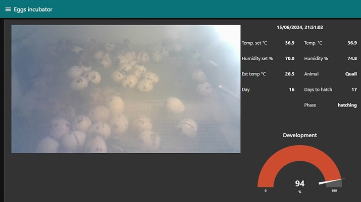

### Project Overview

This project was born out of the desire to see if supermarket quail eggs are actually fertile (unlike chicken eggs). The goal was to explore the possibility of incubating quail eggs and monitor their development.
  
  

---

### The Incubator Design

To achieve this, I designed an **incubator for birds** using a thermally insulated plastic box. The setup is simple but effective for maintaining the right conditions for incubation.
  
  

---

### Temperature and Humidity Control

I managed the **temperature** and **humidity control** using a custom-designed board that features an **ESP32-WROOM** chip. This board was programmed using the **Arduino IDE**, providing full control over the incubator's conditions.

For heating, I used a **220V heater**, which I modulated using a **trimmer**. To maintain proper humidity inside, I used an **electric room humidifier**.

---

### User Interface and Remote Control

The board is equipped with a **color TFT graphical interface**, making it easy to monitor and control the incubator. Additionally, the incubator is controlled directly via a **Telegram bot** on your phone, allowing for remote management. 

For initial setup (WiFi credentials, Telegram token, and password), I added a feature that allows the board to switch to **Access Point (AP) mode**, enabling configuration through a minimal web server. These values are saved in the non-volatile memory of the ESP32, so they persist through future restarts.
  
  

---

### Flexibility and Future Expansion

Currently, the software is configured to handle the **incubation periods**, **temperatures**, and **humidity** levels for chickens and quails. However, the system can easily be extended to accommodate other types of birds as well.
  
  

---

### Data Monitoring and Remote Supervision

The incubator's data can be communicated via **MQTT**, allowing for remote tracking of the incubation process from an external monitoring environment. I personally use **Node-RED** to monitor the data in real-time.

---

### Sharing the Experience

To make the project even more enjoyable, I set up a **live stream on Twitch** of the incubation process. This allows my friends to join in on the excitement and witness the first moments of life for the **❤️chicks❤️**.
  
[twitch channel](https://www.twitch.tv/socketto87)
  
  

  